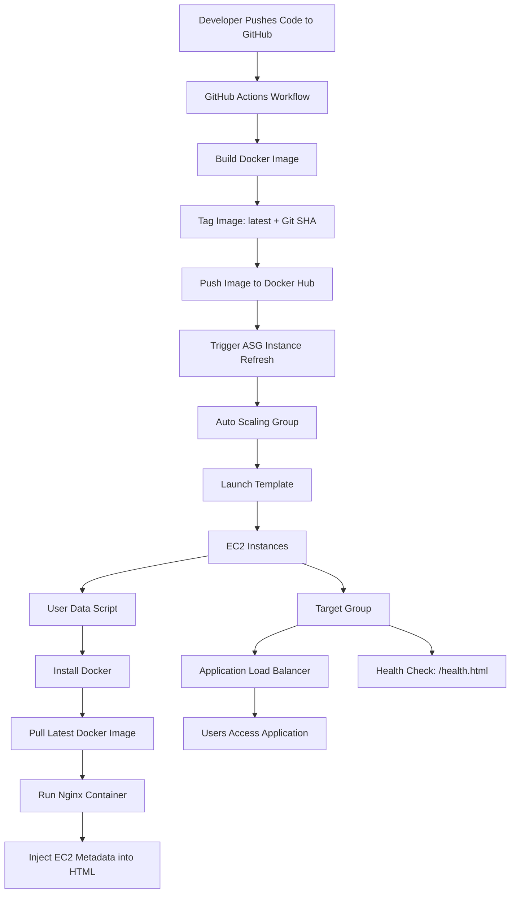

# Dockerized CI/CD Pipeline on AWS with ALB and Auto Scaling Group

## Project Overview

This project demonstrates a Dockerized CI/CD pipeline that automatically builds, versions, and deploys a containerized web application to AWS infrastructure using GitHub Actions, Docker Hub, EC2, Application Load Balancer, Launch Template, and Auto Scaling Group.

The project started as a simple EC2 deployment and was upgraded into a more production-style architecture with load balancing, health checks, runtime instance metadata injection, and rolling instance refresh deployments.

---

## Architecture
Developer
   |
   | git push
   v
GitHub Repository
   |
   v
GitHub Actions Workflow
   |
   | Build Docker image
   | Tag image as latest + Git commit SHA
   | Push image to Docker Hub
   | Trigger ASG Instance Refresh
   v
Docker Hub
   |
   v
AWS Auto Scaling Group
   |
   | Launch Template User Data
   | Install Docker
   | Pull latest Docker image
   | Run Nginx container
   | Inject EC2 metadata into HTML
   v
EC2 Instances
   |
   v
Application Load Balancer
   |
   v
Users access the app through ALB DNS

## Tech Stack
- AWS EC2
- Application Load Balancer
- Auto Scaling Group
- Launch Template
- Security Groups
- GitHub Actions
- Docker
- Docker Hub
- Nginx
- Amazon Linux 2023
- Bash / User Data
- EC2 Instance Metadata Service
- IAM

## Key Features
- Automated CI/CD pipeline using GitHub Actions
- Dockerized static web application served through Nginx
- Docker image tagging using both latest and Git commit SHA
- Docker image pushed to Docker Hub
- Application deployed behind an AWS Application Load Balancer
- Auto Scaling Group launches EC2 instances automatically
- Launch Template user data installs Docker and runs the container
- ALB health check configured using /health.html
- Runtime EC2 metadata injection into the web page
- ASG Instance Refresh used for rolling deployments
- Container restart policy configured using --restart unless-stopped
- EC2 application access restricted through Security Groups

## Deployment Flow
- Developer pushes code to the main branch.
- GitHub Actions workflow starts automatically.
- Workflow logs in to Docker Hub.
- Docker image is built from the Dockerfile.
- Image is tagged with:
  - latest
  - short Git commit SHA
- Both tags are pushed to Docker Hub.
- GitHub Actions authenticates to AWS using IAM credentials stored in GitHub Secrets.
- GitHub Actions triggers an Auto Scaling Group Instance Refresh.
- ASG replaces instances gradually.
- New EC2 instances run Launch Template user data.
- User data installs Docker, pulls the latest image, runs the container, and injects EC2 metadata.
- ALB routes traffic only to healthy instances.

## Docker Image Versioning

The pipeline creates two Docker tags for each build:
- project-3-cicd-web:latest
- project-3-cicd-web:<commit-sha>

Example:
- project-3-cicd-web:latest
- project-3-cicd-web:a1b2c3d

The latest tag is used for deployment, while the commit SHA tag provides traceability and rollback capability.

## Runtime Metadata Injection

Each EC2 instance retrieves its own metadata using the EC2 Instance Metadata Service:
- Instance ID
- Private IP address
- Availability Zone

This metadata is injected into the HTML pages at container startup using user data and sed.
This allows the webpage to display which backend EC2 instance served the request, making ALB load balancing visible during testing.

## Health Check

The application includes a dedicated health check endpoint:
- /health.html

The ALB target group uses this endpoint to verify whether each backend EC2 instance is healthy before routing traffic to it.

## Security Design

- Public users access the application through the ALB DNS endpoint.
- EC2 instances receive application traffic only from the ALB security group.
- Docker Hub token is stored securely in GitHub Secrets.
- AWS access keys are stored securely in GitHub Secrets.
- IAM policy grants GitHub Actions permission to trigger ASG Instance Refresh.
- EC2 user data handles bootstrapping automatically.

## GitHub Actions Workflow Summary

The workflow performs the following actions:
- Checkout code
- Login to Docker Hub
- Create image tag from Git commit SHA
- Build Docker image
- Push Docker image to Docker Hub
- Configure AWS credentials
- Trigger ASG Instance Refresh

## Important Lessons Learned

- Docker containers require host-to-container port mapping.
- Public subnet route to an Internet Gateway is not enough unless the instance has a public IP.
- ALB health checks must match the correct target port and path.
- User data only runs when a new EC2 instance launches.
- Existing ASG instances do not automatically pull new Docker images.
- ASG Instance Refresh can be used to roll out new versions across instances.
- EC2 Instance Metadata Service v2 requires a token-based request.
- Security Groups should restrict EC2 traffic to the ALB instead of exposing instances directly.

## Future Improvements

- Convert the AWS infrastructure into Terraform
- Add CloudWatch alarms and dashboards
- Add deployment approval environments in GitHub Actions
- Add rollback workflow using commit-based Docker tags
- Move EC2 instances into private subnets with NAT Gateway
- Add HTTPS using ACM and ALB listener on port 443

## Project Status

Completed as a hands-on DevOps portfolio project demonstrating:
- CI/CD automation
- Docker
- AWS ALB
- ASG
- rolling deployments

## Architecture Diagram



# What this shows

This diagram explains the full lifecycle:

```text
GitHub push
→ GitHub Actions
→ Docker build
→ Docker Hub
→ ASG refresh
→ new EC2 instances
→ Docker container starts
→ ALB serves traffic
```

This architecture demonstrates a containerized CI/CD deployment pipeline on AWS.  
Code changes pushed to GitHub trigger a GitHub Actions workflow, which builds and versions a Docker image, pushes it to Docker Hub, and refreshes the Auto Scaling Group. New EC2 instances launched through the Launch Template automatically install Docker, pull the latest image, run the containerized Nginx application, and register behind the Application Load Balancer. The ALB performs health checks using `/health.html` and routes traffic only to healthy instances.